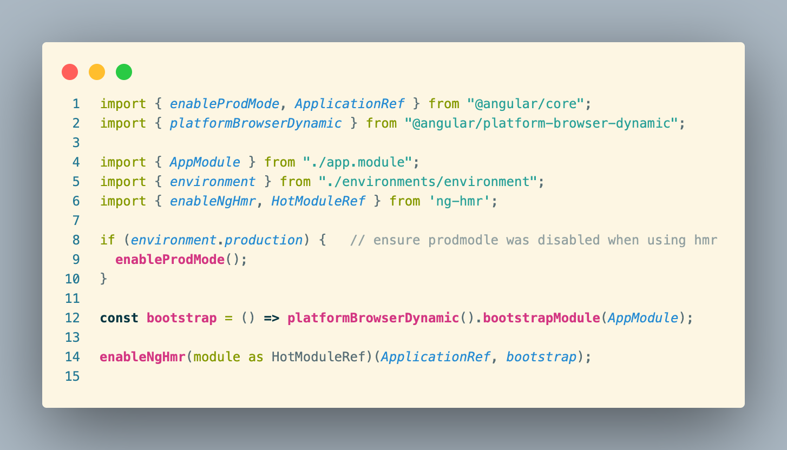

# ng-hmr 🚀

> ### a tool for angular hot reload


## Install 
```shell
npm i @cloud/ng-hmr
```
## Getting started
require `ng-hmr` and `ApplicationRef` in entry:
```ts
import { ApplicationRef } from '@angular/core';
import { enableNgHmr, HotModuleRef } from 'ng-hmr';
```

warp bootstrapModule:
```ts
const bootstrap = () => platformBrowserDynamic().bootstrapModule(AppModule);

enableNgHmr(module as HotModuleRef)(ApplicationRef, bootstrap)
```
**enjoy~**
## Enable in ng-cli
Enable in ng-cli,run with hmr option `"ng serve --hmr"` or update `package.json` insides scripts block with `--hmr`

```json
 "scripts": {
    "start": "ng serve --hmr",
    // other options...
  }
```
then run `"npm run start"`.


> Note: Consider like follwing example.

Full example like this:


## What about productuion?

> ng-hmr is safe to use in production; it's leave a minimal footprint, so there is no need to complicate your configuration based on the environment.

## 
> see in other pageTroubleshooting